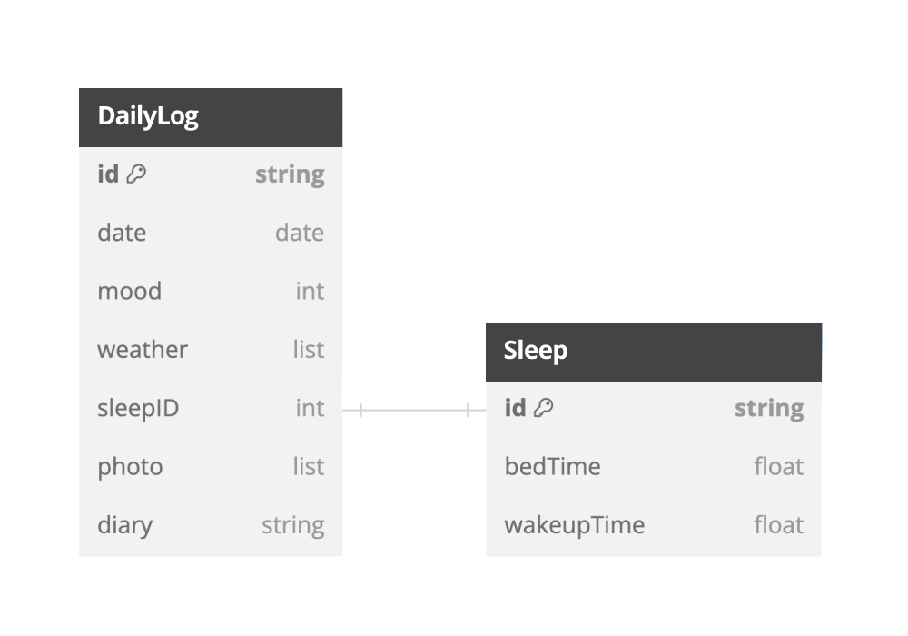

# Simlog
하루의 심플한 기록을 위한 일기 앱
- [🔗 App Store 바로가기](https://apps.apple.com/kr/app/simlog-%EC%8B%AC%ED%94%8C%ED%95%9C-%ED%95%98%EB%A3%A8-%EA%B8%B0%EB%A1%9D/id6470668417)

<p align="center" width="100%">
    
    
    
    
</p>

🥇 하루를 1~100의 점수로 표현해 보세요.  
☀️ 그날의 날씨를 기록하세요.  
😴 원형 슬라이더를 사용해 손쉽게 수면 시간을 선택하세요.  
📸 기억하고 싶은 순간을 사진으로 등록하세요.  
📝 어떤 일이 있었는지 하루를 작성해 주세요.

🎨 나의 기분을 색으로 나타내줘요!  
👀 달력에서 한 달 동안 내 기분이 어땠는지 한눈에 볼 수 있어요

|||||
|:-:|:-:|:-:|:-:|
|일기 작성|일기 수정|일기 삭제|다크 모드|

## 목차

[프로젝트 정보](#프로젝트-정보)  
[주요 기능](#주요-기능)  
[기술 스택](#기술-스택)  
[구현 내용](#구현-내용)  
[문제 및 해결](#문제-및-해결)  
[회고](#회고)

## 프로젝트 정보

- 최소 버전: iOS 15.0
- 개발 환경: Xcode 15.0.1, swift 5.9
- 개발 기간: 23.10.01 ~ 23.10.31 (1개월)
- 개발 인원: 1명

## 주요 기능

- 일기 작성 기능
- 일기 수정/삭제 기능
- 사진 저장 기능
- 다크 모드 대응

## 기술 스택

- `UIKit` `CodebaseUI` `MVVM`
- `SnapKit(5.6.0)` `Kingfisher(7.9.1)`
- `Realm(10.43.0)` `Firebase(10.16.0)`
- `FSCalendar(2.8.4)` `HGCircularSlider(2.2.1)` `Loaf(0.7.0)`

## 구현 내용

- ViewController의 역할을 간소화하고 명확히 정의하기 위한 MVVM 패턴 적용
- Observable 클래스를 구현하여 보다 선언적이고 반응적인 방식으로 데이터를 관리
- Firebase Analytics, Crashlytics를 사용하여 애플리케이션의 성능을 모니터링하고 사용자 경험을 최적화
- FSCalendar를 이용하여 월별 기분 상태를 한눈에 파악할 수 있도록 시각화
- RealmDB를 이용한 일기 저장 기능
- Diffable DataSource를 이용해 날씨 선택시 자연스러운 애니메이션 구현
- PhotosUI를 이용한 사진 불러오기 기능
- FileManager를 이용하여 로컬 저장소에 파일을 저장하고 관리

### ERD

<!-- visual studio code -->


### Architecture

<!-- visual studio code -->


## 문제 및 해결

### 1. AddDailyLogView에서 화면 띄우기

#### 🚨 문제 상황

일기 추가 화면에서 수면 시간 추가 버튼을 클릭하면, 수면 시간을 조정할 수 있는 원형 슬라이더가 나오고 배경으로는 블러된 일기 추가 화면이 보이도록 구현하려던 상황

1. AddDailyLogView도 present, AddBedTimeView도 present로 띄웠더니 AddDailyLogView가 내려가 버리는 문제 발생.  
2. 연속적으로 present를 사용했기 때문에 문제가 발생했는지 의심이 들어서, AddDailyLogView는 CATransition을 활용하여 아래에서 위로 올라오는 push 방식으로, AddBedTimeView는 present 방식으로 뷰를 보여줌 -> AddBedTimeView 아래에 AddDailyLogView가 보여야 하는데 보이지 않게 됨

#### ✅ 해결

UIModalPresentationStyle.overCurrentContext 사용

- fullScreen, currentContext
  - 원래 있던 view를 없앰. 새로운 view의 배경이 투명한 배경이어도 원래 보이던 view가 없어지기 때문에 문제-2에서 AddDailyLogView가 보이지 않았던 것
  - fullScreen은 device 크기에 대응하는 view를 보여줌.  
  currentContext는 present를 지시하는 VC의 view위에만 view를 보여줌.
- overFullScreen, overCurrentContext
  - 원래 있던 view를 없애지 않음. (뒤의 배경이 보이는 팝업을 만들 때 유용 -> 나의 경우!)
  - overFullScreen은 definesPresentationContext 값에 상관 없이 view를 덮어버림.  
  overCurrentContext는 definesPresentationContext 값에 따라 view가 덮이는 범위 설정 가능

overCurrentContext를 사용하니 present-present로 화면을 띄워도 1번 문제가 발생하지 않음  
추가로, modalTransitionStyle.crossDissolve를 활용하여 화면이 아래에서 위로 올라오는 대신, 부드럽게 화면 위에 덮이는 방식으로 자연스러운 전환 효과 적용

||||
|:-:|:-:|:-:|
|문제1|문제2|해결|

### 2. remakeConstraints 시점

#### 🚨 문제 상황

일기를 선택하면 선택한 일기의 내용에 맞게 뷰가 확장되어야 했지만, 이전에 선택했던 일기의 내용 길이만큼 높이가 설정되는 문제가 발생. 이로 인해, 이전 선택 일기보다 내용이 많은 경우, 내용이 제대로 보이지 않고 찌그러지는 현상이 나타남.

#### ✅ 해결

reloadData 호출 이후에 layoutSubviews에서 높이를 재조정하도록 구현

```swift
logTableView.reloadData()

logTableView.snp.remakeConstraints { make in
    make.top.equalTo(dateLabel)
    make.leading.equalTo(separator.snp.trailing).offset(15)
    make.trailing.equalTo(self).inset(padding)
    make.bottom.equalTo(self).inset(padding)
    make.height.equalTo(logTableView.contentSize.height)
}
```

기존에는 테이블 뷰에 들어갈 데이터를 설정한 후 reloadData를 호출하여 테이블 뷰를 생성하고, 그 다음에 remakeConstraints를 사용하여 높이를 재설정. 그러나 reloadData를 실행한 후 테이블 뷰를 그리는 데 시간이 걸렸기 때문에, 높이를 재설정하는 시점에는 아직 새로운 높이가 아닌 이전 높이가 적용되었던 것.

```swift
final class ResizedTableView: UITableView {
    
    private var reloadDataCompletionBlock: (() -> Void)?
    
    func reloadDataWithCompletion(_ complete: @escaping () -> Void) {
        reloadDataCompletionBlock = complete
    }
    
    override func layoutSubviews() {
        super.layoutSubviews()
        
        guard let block = reloadDataCompletionBlock else { return }
        
        block()
    }
    
}
```
```swift
logTableView.reloadDataWithCompletion { [unowned self] in
    let tableViewHeight = logTableView.contentSize.height
    
    logTableView.snp.remakeConstraints { make in
        make.top.equalTo(dateLabel)
        make.leading.equalTo(separator.snp.trailing).offset(15)
        make.trailing.equalTo(self).inset(padding)
        make.bottom.equalTo(separator)
        make.height.equalTo(tableViewHeight < 100 ? 100 : tableViewHeight)
    }
}
```

테이블 뷰의 reloadData 메서드가 완료될 때 콜백을 실행할 수 있게 하는 커스텀 클래스를 구현.
뷰의 크기나 위치가 변경되었을 때 실행되는 layoutSubviews 메서드 안에서 remakeConstraints를 실행시킴으로써 바뀐 높이가 적용되도록 함.

|||
|:-:|:-:|
|문제1|해결|

### 3. DateFormatter 비용

#### 🚨 문제 상황

DateFormatter는 locale, timezone, calendar 등의 다양한 설정을 처리하고, 복잡한 날짜와 시간 형식을 파싱하고 형식화하기 때문에 생성하고 설정하는 데 상당한 비용이 듦.

#### ✅ 해결

필요할 때마다 새로 생성하는 대신, DateFormatter 인스턴스를 한 번 생성하고 필요할 때마다 재사용.

DateFormatter를 singleton으로 생성하여 앱 전체에서 재사용하도록 AppDateFormatter 생성. 하지만, singleton pattern은 동시성 문제를 일으킬 수 있기 때문에 DispatchQueue를 사용하여 한 번에 하나의 스레드에서만 DateFormatter를 수정하고 사용하도록 함.

```swift
class AppDateFormatter {
    
    static let shared = AppDateFormatter()
    private init() {}
    
    private lazy var dateFormatter: DateFormatter = DateFormatter()
  
    func toString(date: Date,
                  locale: String = Locale.current.identifier,
                  timeZone: String = TimeZone.current.identifier,
                  type: DateFormatType) -> String
    {
        var result: String = ""
        let queue = DispatchQueue(label: "DateFormatterQueue")
        
        queue.sync {
            dateFormatter.timeZone = TimeZone(abbreviation: timeZone)
            dateFormatter.locale = Locale(identifier: locale)
            dateFormatter.dateFormat = type.description
            result = dateFormatter.string(from: date)
        }
        
        return result
    }
    
    func toDate(date: String,
                locale: String = Locale.current.identifier,
                timeZone: String = TimeZone.current.identifier,
                type: DateFormatType) -> Date?
    {
        var result: Date = Date()
        let queue = DispatchQueue(label: "DateFormatterQueue")
        
        queue.sync {
            dateFormatter.timeZone = TimeZone(abbreviation: timeZone)
            dateFormatter.locale = Locale(identifier: locale)
            dateFormatter.dateFormat = type.description
            result = dateFormatter.date(from: date) ?? Date()
        }
        
        return result
    }
    
}
```


## 회고

### 개인 앱 출시 경험

처음으로 혼자 기획부터 디자인, 개발, 출시까지 해보았습니다. 난관을 같이 헤쳐나갈 팀원이 없다니.. 조금 두려웠지만 동료들과 조를 구성하여 매일 어제 한 일, 오늘 할 일, 고민 중인 문제점에 대해 회고하는 시간을 가짐으로써, 걱정을 해소할 수 있었습니다. 동료들의 진척사항을 보며 '우와 벌써 이 정도까지 진행하셨네. 나도 더 열심히 해야겠다.'라는 자극을 받아 힘을 낼 수 있었습니다.

계획을 세우고 할 일에 대한 공수를 산정하여 작업을 시작했지만, 예상치 못한 오류 발생이나 예상보다 복잡한 작업으로 인해 실제로는 공수 산정 시간보다 훨씬 많은 시간을 소비하게 되는 경우가 자주 있었습니다. 일이 문제 없이 순조롭게 진행될 것만을 예상하고 계획했던 것 같아서, 앞으로는 예상치 못한 상황도 고려하여 좀 더 넉넉하게 공수를 산정하고 계획을 세워야겠다는 생각을 하게 되었습니다.
